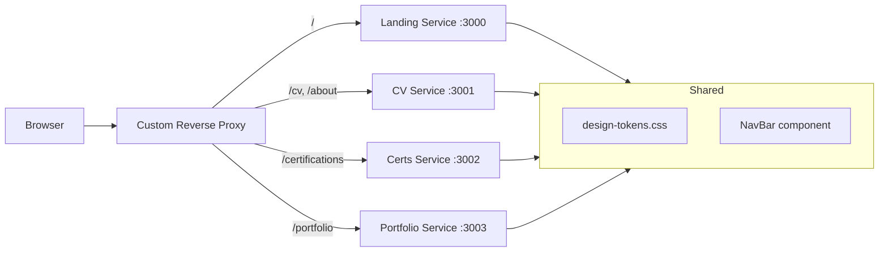

Updated todo list

Profile exploration

Read 

Read 

Read 

Read 

Read 

Read 

Read , lines 1 to 80

Read , lines 1 to 60

Read , lines 1 to 60

Read , lines 1 to 80

Read , lines 1 to 60

Read , lines 1 to 60

Read , lines 1 to 60

Read 

Read 

Read 

Read 

Read 

Read , lines 1 to 40

Read , lines 1 to 40

Read 

Read 

Good. I have a comprehensive picture of you. Here's the full product analysis.

---

## Profile Synthesis

**Dimitris Miaoulis** — Cloud Architect/Engineer with a genuinely rare span: from sEMG hardware signals and BLE/LoRa embedded systems → through Terraform/AWS serverless architecture → up to AI/LLM RAG pipelines. You have two deliberate career tracks (architect vs. engineer), a biomedical research background, and deep sports-tech specialization. Mid-to-Senior level, likely 5–8 years of experience.

Your biggest differentiator: almost no one sits comfortably across all four layers (embedded → infra → cloud → AI). That's your brand.

---

## Product Vision: "Signal to Cloud"

The website's brand concept: **the full-stack human** — from hardware signals to distributed cloud systems. Discreet but specific enough to be memorable to anyone technical.

### Design System

| Token | Value | Rationale |
|---|---|---|
| Background | `#0a0f1e` (deep navy) | Clean dark, not GitHub-dark cliché |
| Surface | `#111827` (slate-900) | Cards, panels |
| Accent | `#06b6d4` (cyan-500) | Technical, not aggressive |
| Secondary | `#8b5cf6` (violet-500) | Architect/AI dimension |
| Text | `#e2e8f0` | Soft, readable |
| Mono font | `Geist Mono` or `JetBrains Mono` | Code labels, tech badges |
| Body font | `Inter` | Clean, neutral |

Single `design-tokens.css` (CSS variables) imported by every service — this is what makes separate services look like one product.

**Creative touches** (discreet, not loud):
- Thin SVG signal waveform (ECG-style) as the hero's decorative underline — references your research without explaining it
- Subtle animated particle-graph background (very low opacity) in landing only — references cloud topology
- Micro-interactions: tech badge hover, card lift on hover, smooth page transitions

---

## Architecture — Product-Minded

Each service is independently deployable, independently runnable. The reverse proxy just does path-prefix routing — this is exactly the learning surface of your custom-reverse-proxy repo.

---

## Per-Service UX Decisions

### `/` — Landing
- **One job**: communicate who you are in under 5 seconds
- Hero: name + dual tagline that hints at the two tracks → *"Cloud architect. From signal to scale."*
- 4 quick-nav tiles below: About, CV, Certifications, Portfolio
- No scroll required for the core message
- The waveform decoration lives here only
- **Tech**: pure Vite + React (zero SSR needed, fast, your existing stack)

### cv and `/about`
**This is the most impactful design decision: split the CV into two modes.**

Since you have `CV_Dimitris_Miaoulis_arch.pdf` and `CV_Dimitris_Miaoulis_eng.pdf`, expose this as a toggle:

> **[Architect view] / [Engineer view]**

Each mode reorders/reweights the same content. Architects see platform design, Terraform modules, multi-account strategy first. Engineers see implementation depth, Python, specific AWS service mastery first. Both get a PDF download of the matching version.

`/about` is the storytelling page: research paper, basketball tech angle, the IoT→cloud arc. 2–3 paragraphs max. Personal, not corporate.

### `/certifications`
- Card grid, 2–3 columns
- Card front: badge image + cert name + issuer
- Card hover (or click): flip to show issue date, credential ID, verify link
- Filter pills: `AWS` / `Azure` / `Other`
- **Do not just link to Credly** — render your own cards. It looks intentional and designed.

### `/portfolio`
**This is the richest surface — treat it as a portfolio curator, not a GitHub mirror.**

- Filter tags: `cloud` / `ai-ml` / `iot` / `web` / `research`
- Each card: project name, 1-line description, tech stack badges (icons), GitHub link
- Add a subtle **complexity indicator** (1–5 scale, borrowing from your "overengineered-weekend" humor) — this is a distinctive, personality-showing touch
- Featured projects pinned at top: `EuroleagueTech Platform`, `File Secure Exchange`, LinkedIn-LLM, `Muscle Insight`

### `/portfolio/{slug}` — Per-portfolio-item pages
This is where you go deep. For each project:
- Architecture diagram (Mermaid — you already have these in your READMEs)
- The **"why"** (the problem, not just the solution)
- Tech stack with rationale snippets
- Key decisions: e.g., *"chose DynamoDB single-table design because..."*
- Status badge: Live / Research / WIP
- Links: GitHub, live URL if any

**Do not auto-generate these from your READMEs** — write them fresh. Your READMEs are engineer-facing; project pages are recruiter/collaborator-facing.

---

## Product Roadmap (phased)

**Phase 1 — Foundation** *(get the proxy working)*
1. Implement path-prefix routing in custom-reverse-proxy
2. Build `design-tokens.css` + shared `NavBar` component
3. Landing service (`/`) — static, fast, the waveform hero
4. Portfolio index (`/portfolio`) — card grid, your top 6 items

**Phase 2 — Identity**
5. CV service with the Architect/Engineer toggle
6. Certifications service (card grid)

**Phase 3 — Depth**
7. Individual portfolio item pages (`/portfolio/{slug}`) — start with file-secure-exchange since that's already in your plan
8. About page

---

## Deployment Options (pick one based on goal)

| Goal | Stack |
|---|---|
| **Learn reverse proxy** (your current goal) | Local: custom-reverse-proxy → `localhost:300x` services. Deploy: single EC2/VPS + Nginx/Caddy in front of your custom proxy |
| **AWS-native** (your specialty, showcase it) | CloudFront with multiple S3 origins per path prefix — CloudFront *is* a managed reverse proxy. Add this to the project page as meta-commentary |
| **Hybrid** | Custom proxy locally for dev, CloudFront in prod — mirrors how enterprises use local API Gateway for dev |

The AWS-native path has an elegant angle: your personal site *itself* becomes a project you can feature at `/portfolio/personal-website`.

---

## One Key Product Principle

**The site should read differently to a recruiter, an engineer, and a researcher** — without being three different sites. The Architect/Engineer toggle on cv handles the recruiter dimension. The project depth pages handle the engineer dimension. The About page and Muscle Insight/ECG projects handle the researcher dimension. One design system, one nav, three audiences.

Want me to start building any of these services? I'd suggest starting with the shared design system + Landing + the reverse proxy routing config.

Created 4 todos